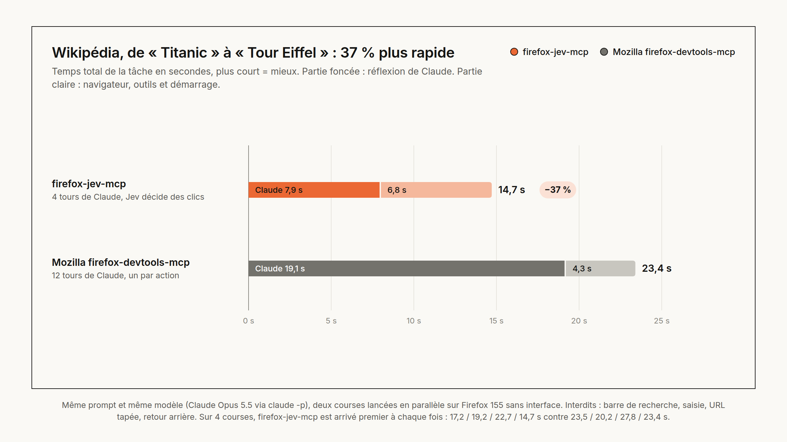
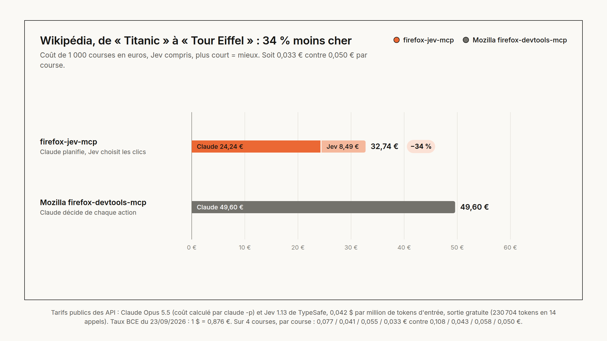
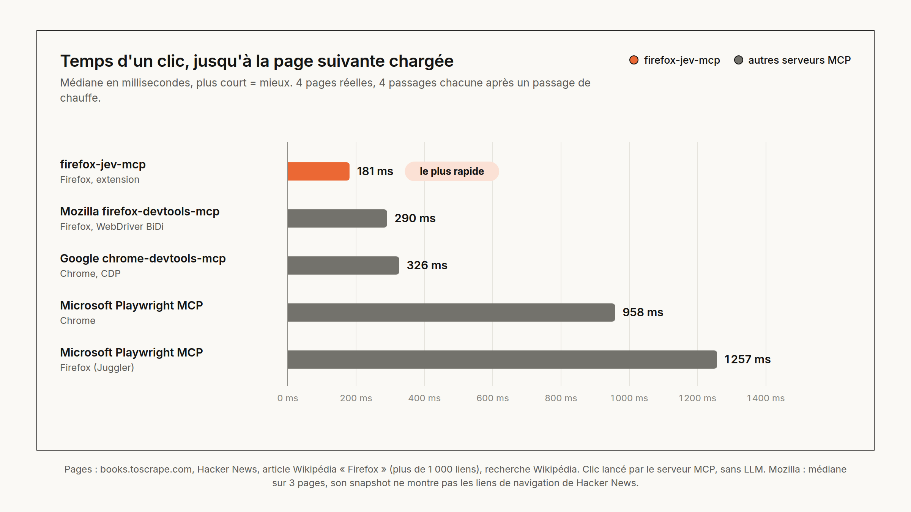

# firefox-jev-mcp

Un serveur MCP qui permet à Claude de piloter Firefox, avec un modèle de décision rapide pour les clics :
**Claude planifie, [Jev](https://docs.typesafe.ai) (TypeSafe) choisit l'élément sur lequel agir**, et
Claude ne reprend la main que quand Jev hésite.



## Pourquoi

Avec un serveur MCP de navigateur classique, le LLM relit la page et décide de **chaque** clic : un tour de
modèle par action, soit quelques secondes à chaque fois. Or la plupart des clics sont des décisions simples
(« quel lien mène à Paris ? »). firefox-jev-mcp les confie à Jev, un modèle qui ne génère pas de texte mais
renvoie une probabilité par élément de la page, en environ une seconde. Claude garde ce qu'il fait le mieux :
comprendre la demande, planifier, trancher les cas ambigus.

## Résultats

Même tâche, même prompt, même modèle (Claude Opus 5.5 via `claude -p`), deux courses lancées en parallèle :
partir de l'article Wikipédia « Titanic » et atteindre « Tour Eiffel » en cliquant uniquement sur des liens
(ni recherche, ni saisie, ni URL tapée, ni retour arrière).

| Course Wikipédia | **firefox-jev-mcp** | Mozilla firefox-devtools-mcp |
|---|:---:|:---:|
| Temps total | **14,7 s** | 23,4 s |
| dont réflexion de Claude | **7,9 s** | 19,1 s |
| Tours de Claude | **4** | 12 |
| Tokens Claude | **20,8 k** | 88,5 k |
| Coût par course, Claude et Jev compris | **0,033 €** | 0,050 € |

Sur 4 courses, firefox-jev-mcp est arrivé premier à chaque fois : 17,2 / 19,2 / 22,7 / 14,7 s contre
23,5 / 20,2 / 27,8 / 23,4 s (les premières avec des versions antérieures du serveur).



Les actions de base, mesurées sans LLM sur 4 pages réelles (médiane de 4 passages après un passage de chauffe) :

| Actions de base | **firefox-jev-mcp** | Mozilla firefox-devtools-mcp | Google chrome-devtools-mcp | Playwright MCP | Playwright MCP |
|---|:---:|:---:|:---:|:---:|:---:|
| Navigateur | Firefox | Firefox | Chrome | Chrome | Firefox |
| Clic, jusqu'à la page suivante chargée | **181 ms** | 290 ms ¹ | 326 ms | 958 ms | 1 257 ms |
| Navigation vers une URL | 186 ms | **129 ms** ² | 280 ms | 248 ms | 388 ms |
| Snapshot d'un article Wikipédia, en tokens ³ | 3,7 k | 1,1 k ⁴ | 215 k | 209 k | 209 k |

¹ Médiane sur 3 pages : son snapshot ne montre pas les liens de navigation de Hacker News.
² Rend la main dès que le HTML est analysé (DOMContentLoaded), avant la fin du chargement.
³ Estimation : caractères divisés par 4.
⁴ Tronqué à 100 lignes par défaut.



Tarifs utilisés : prix publics des API (Claude Opus 5.5, Jev 1.13 à 0,042 $ par million de tokens d'entrée,
sortie gratuite), taux BCE du 23/09/2026. Méthode, données brutes et scripts pour tout reproduire :
[`bench/`](bench/README.md).

## Comment ça marche

```
Claude Code
   |  outils MCP (stdio)
   v
Serveur MCP local (server/, TypeScript)
   |-- API Jev : un Choice sur les éléments de la page + un Noul « objectif atteint ? »,
   |             puis des Nouls de vérification quand le Choice hésite
   |
   |  WebSocket ws://127.0.0.1:8765 (origine moz-extension:// uniquement)
   v
Extension Firefox (extension/)
   |-- content.js : extraction des éléments interactifs, clics, saisie
   '-- background.js : pont WebSocket, onglets, navigation
```

L'outil `browse_goal` enchaîne seul : snapshot de la page, décision de Jev, action, et ainsi de suite jusqu'à
l'objectif. Il s'arrête quand l'objectif est atteint, quand Jev hésite ou quand l'action est sensible (payer,
supprimer, envoyer...), et renvoie alors à Claude les meilleurs candidats, directement utilisables. Claude
reste l'orchestrateur : l'extension ne contacte jamais Claude, ce qui fonctionne avec un abonnement Claude,
sans clé API Anthropic.

<details>
<summary><b>Comment Jev décide, étape par étape</b></summary>

1. **Fusion des doublons.** Les liens qui mènent à la même URL (menu, carte, pied de page) deviennent une seule
   option. Les probabilités d'un Choice font toujours 1 au total : sans fusion, Jev répartit la sienne entre des
   liens équivalents et sa confiance baisse alors qu'il n'hésite pas sur la destination.
2. **Éléments déjà utilisés retirés.** Un élément déjà cliqué ou rempli sur la page courante n'est plus proposé,
   ce qui évite les boucles.
3. **Texte à saisir connu de Jev.** Avec `typeText`, Jev sait qu'une recherche est possible. Sans `typeText`,
   les champs de recherche ne lui sont pas proposés.
4. **Choice + Noul « objectif atteint ? »** dans une seule requête.
5. **Vérification quand le Choice hésite.** Sous `minConfidence` (0,6), un second appel pose un Noul par candidat
   parmi les 3 premiers : « cette action fait-elle avancer vers l'objectif ? ». Le Choice est relatif et partage
   sa probabilité entre plusieurs chemins valables ; le Noul est absolu. La boucle agit si le candidat choisi
   atteint `verifyThreshold` (0,8), sinon elle rend la main à Claude.
6. **Contrôle d'arrivée.** Après chaque action, un Noul voit la page précédente, l'action faite et la page
   courante, pour les objectifs définis par la page de départ (« la 3e histoire », « le livre le moins cher »).
7. **Listes déroulantes.** Un Choice sur les options désigne la valeur à sélectionner.
8. **Saisie.** `typeText` n'est tapé qu'une fois, et Entrée n'est pressée que dans un champ de recherche.

Au-delà de 250 options (l'API limite un Choice à 255), la décision se fait en deux passes : un Choice par
tranche de 200, en requêtes parallèles, puis un Choice final sur les 5 meilleurs de chaque tranche.

</details>

## Installation

Prérequis : Node.js 20 ou plus, Firefox 142 ou plus, une clé API TypeSafe ([console.typesafe.ai](https://console.typesafe.ai)).

```bash
npm install
cp .env.example .env   # puis renseigner TYPESAFE_API_KEY
```

1. Lancer Firefox avec l'extension, dans un profil dédié (`./firefox-profile`, créé au premier lancement) :

   ```bash
   npm run firefox
   ```

   Le badge de l'extension affiche `ON` quand le serveur MCP est joignable.

2. Brancher le serveur sur Claude Code : lancer `claude` depuis ce dossier (le fichier `.mcp.json` est détecté),
   ou l'enregistrer pour tous les projets :

   ```bash
   claude mcp add firefox-jev --scope user -- "$(pwd)/node_modules/.bin/tsx" "$(pwd)/server/src/index.ts"
   ```

3. Demander par exemple à Claude : « avec browse_goal, ouvre la documentation de l'API sur example.com ».

## Outils MCP

| Outil | Rôle |
|---|---|
| `browse_goal` | Navigation autonome vers un objectif : snapshot, décision de Jev, action, en boucle |
| `jev_rank` | Classement des éléments de la page par Jev pour un objectif, sans agir |
| `browser_snapshot` | Éléments interactifs visibles, avec un ref (`e1`, `e2`...) |
| `browser_act` | `click`, `type` (avec `submit` pour Entrée) ou `select` sur un ref |
| `browser_navigate` | Ouvrir une URL (onglet actif ou nouvel onglet) ou revenir en arrière |
| `browser_read` | Texte visible de la page |
| `browser_scroll` | Défiler d'un écran |
| `browser_status` | Connexion à l'extension, présence de la clé Jev, liste des onglets |

<details>
<summary><b>Statuts de <code>browse_goal</code></b></summary>

- `done` : Jev estime que la page satisfait l'objectif (`goalThreshold`, 0,85 par défaut).
- `need_decision` : Claude doit trancher ; `reason` explique pourquoi et `candidates` donne les 5 meilleurs refs.
- `max_steps` : nombre d'étapes atteint (`maxSteps`, 6 par défaut).
- `error` : incident technique ; les étapes déjà faites sont conservées.

</details>

## Limites connues

- **Clics synthétiques** : Firefox n'offre pas aux extensions d'équivalent à l'API `debugger` de Chrome. Les
  événements ont `isTrusted = false`, ce que certains sites (anti-bot, paiement, OAuth) ignorent.
- **Iframes** non explorées ; Shadow DOM ouverts et fermés pris en charge.
- **1 000 éléments au plus** par snapshot : sur un très long article, les derniers liens ne sont pas proposés.
- **Une seule session** à la fois : le port 8765 est pris par le premier serveur lancé.
- **Planification** : Jev excelle quand le lien cible est sur la page, moins pour choisir une page intermédiaire.
  Il rend alors la main à Claude.
- **Langue** : Jev est surtout entraîné en anglais ; formuler les objectifs en anglais donne de meilleurs résultats.
- **Confidentialité** : l'URL, le titre, les libellés des éléments et le début du texte des pages visitées par
  `browse_goal` ou `jev_rank` sont envoyés à l'API TypeSafe. L'extension ne tourne que dans le profil dédié.

## Licence

MIT, voir [LICENSE](LICENSE).
